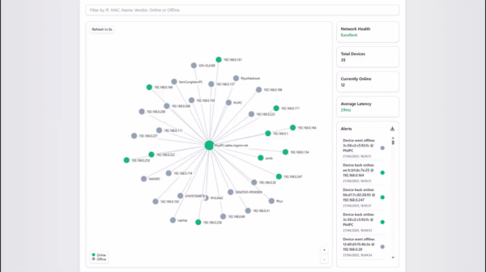

# NetView



**NetView** is an intuitive, user-friendly network monitoring tool that discovers devices on your LAN and displays real-time statistics. Built in Python with a clean Nuxt interface.

---

## 🚀 Features

- **Network Discovery** – Scans local subnet for active hosts (ARP, ICMP).  
- **Device Details** – Displays IP, MAC, hostname, OS guess.  
- **Real-Time Updates** – Live refresh of device status & traffic stats.  
- **Export Data** – Download Alerts History via a Text file.

---

## 🖥️ Installation

1. **Clone the repo**  
   ```bash
   git clone https://github.com/RhysMarch/NetView.git
   cd NetView
